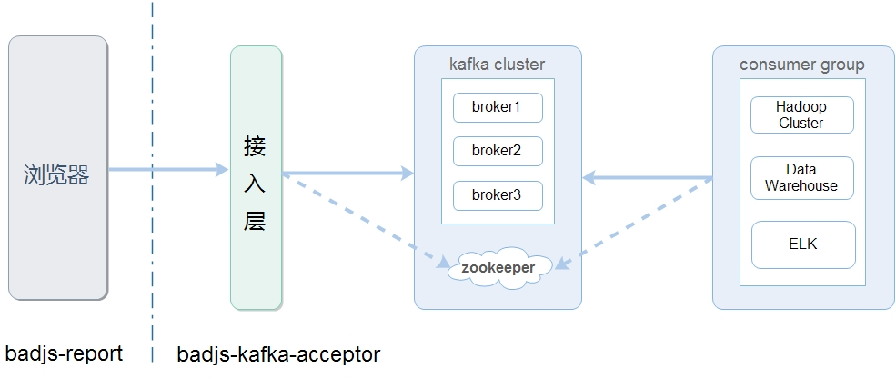

#badjs-kafka-accpeter

> Accept log by client report, filter log and dispatch to kafka

# 简介

`badjs-kafka-accpeter` fork 自 [badjs-accpeter](https://github.com/BetterJS/badjs-acceptor)， 并通过 [kafka-node](https://github.com/SOHU-Co/kafka-node) 实现一个可推送日志消息到kafka的dispatcher模块，从而提供一套基于kafka的 web 前端脚本错误监控、跟踪及分析的解决方案。什么情况你可能需要它：

- 恰巧你或者公司有一个kafka环境（当然你可以自己搭一个并不会耗费很多时间）
- 后端的日志都存在在kafka，实现前后日志统一存储和分析
- kafka拥有良好的性能
- 基于kafka搭建ELK对大数据日志检索分析管理
- 基于kafka的hadoop，更容易实现

值得注意的是 [badjs](https://github.com/BetterJS/doc), 是 鹅厂 提供的一套 web 前端脚本错误监控及跟踪解决方案，是非常优秀的，在使用本方案前也需要对`badjs`有所了解

# 架构说明




- `badjs-report`, 前端日志上报与JS异常监控，使用方法见[badjs-report](https://github.com/BetterJS/badjs-report)
- `badjs-kafka-accpeter`, 接入服务
- `Kafka`, 数据存储服务， 了解[Kafka](http://kafka.apache.org)

# 启动参数

--debug  log 采用debug 级别 , 默认使用info 

--project 使用测试环境（ project.debug.json ）配置 ， 默认使用 project.json

# 配置说明

```
{
    "port" : 80,  // 启动端口
    "dispatcher": {   //推送日志给那台机器，这里配置推送给 badjs-mq
        "port": 10001,   
        "address": "127.0.0.1",
        "subscribe": "badjs",       //数据分发采用 pub/sub 模块，这个是 subscriber 需要 subscribe 的 key 
        "module" : "./dispatcher/kafka"  // 指定 kafka 模块
    },
    "interceptors" : 
            [
            "./filter/comboPreprocess"  ,
            "./filter/addExtStream" ,
            "./filter/excludeParam"  ,
            "./filter/str2Int"  
            ]
}
```